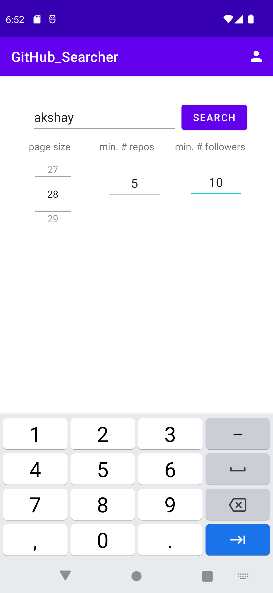

# kotlin-github-searcher

A Kotlin based native android application that lets users search for github profiles.

Here are some `features` of the app:

  1. Search github profiles by entering a user name.
  2. Modify `page size`, `minimum repo count` and `minimum followers` and store values in **Shared Preferences** to store           these values for the user.
  3. Use **Retrofit** to make network calls and handle responses.
  4. Detect internet connectivity and alert user in case internet is not available.
  5. **Picasso** for image processing.
  6. Use **Webview** to display complete github profiles in case the user wants to visit the profile.
